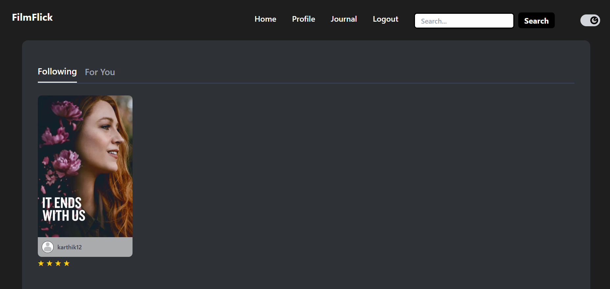
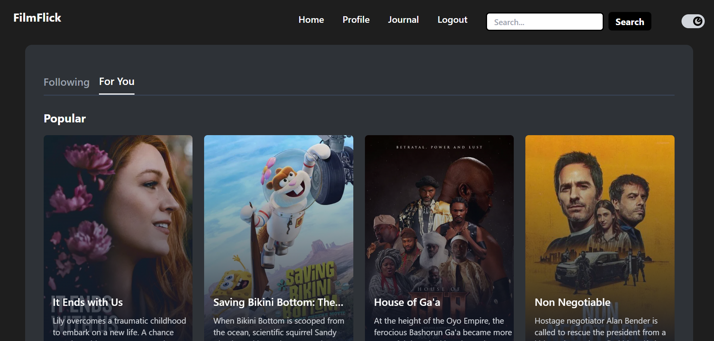
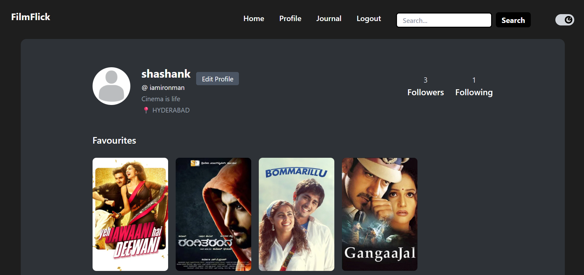
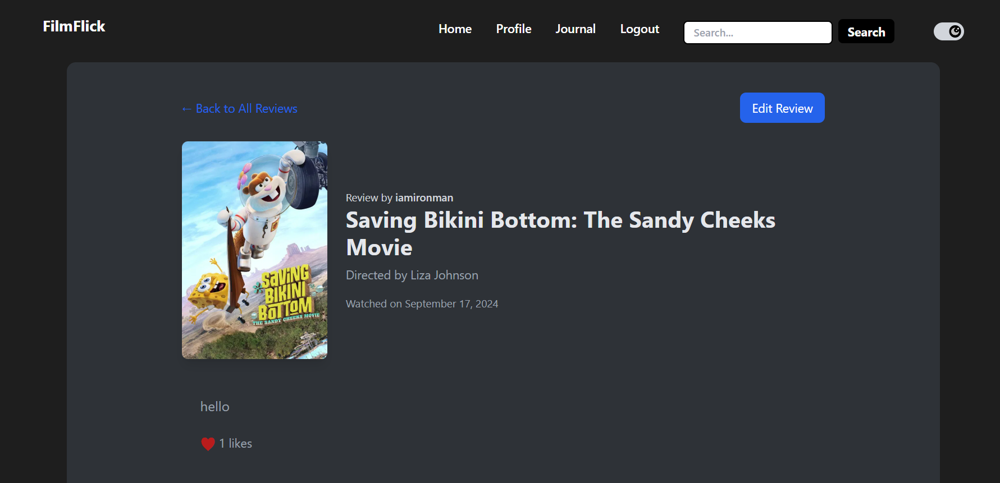
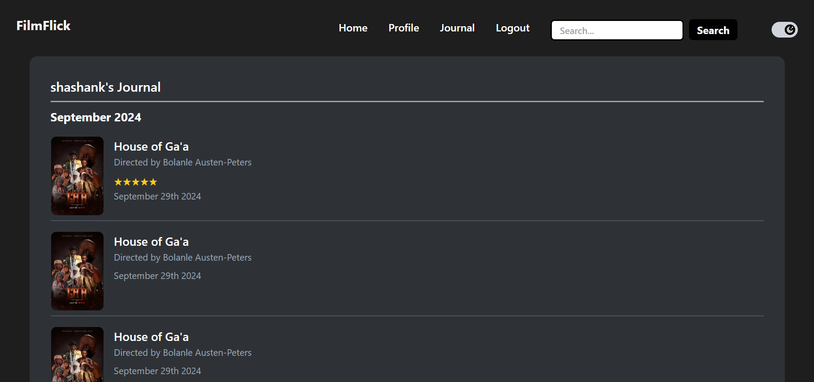
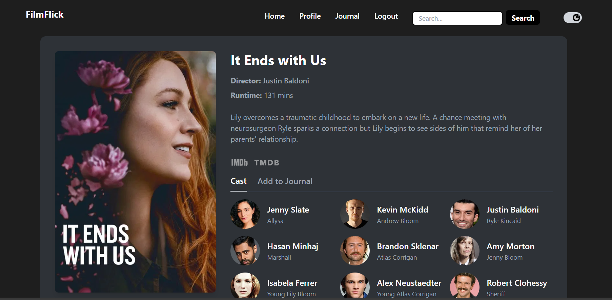
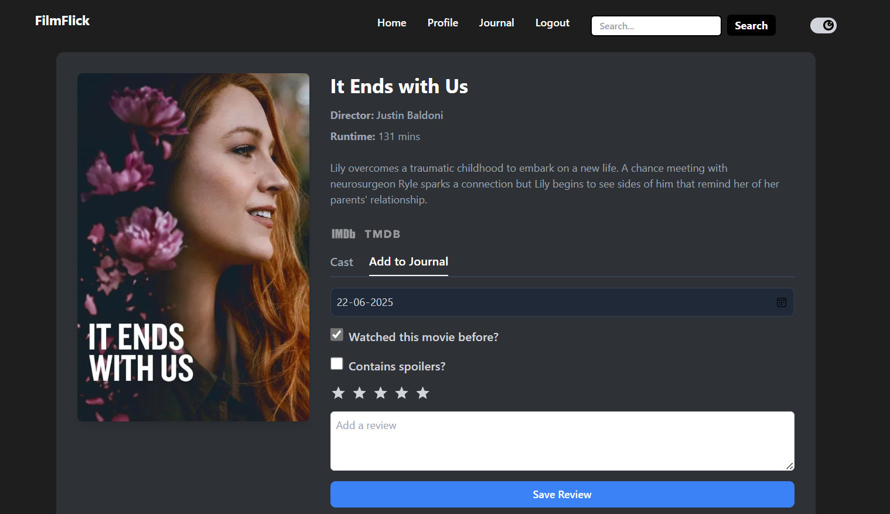
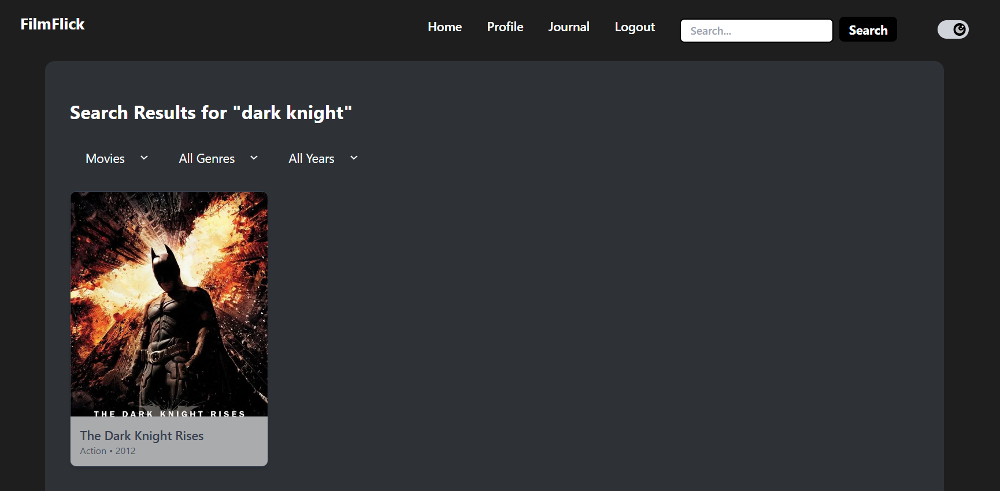

🎬 FilmFlick
FilmFlick is a full-stack movie discovery and review platform. Users can explore movies, write reviews, follow friends, and maintain their personal movie journal — all in one place.

🛠️ Tech Stack
**Frontend**:  
- React.js  
- Redux Toolkit  
- Axios  
- Tailwind CSS  

**Backend**:  
- Node.js  
- Express.js  
- MySQL  
- JWT for authentication  
- dotenv for environment configuration  
- cookie-parser & CORS  

🚀 Features
- 🔐 User authentication (signup, login, logout)
- 🎥 Browse and search movies (powered by TMDB API)
- 📝 Write and edit reviews
- ⭐ Rate movies and track favourites
- 👤 Follow/unfollow users
- 📔 Personal movie journal
- 🔍 Hybrid search (search movies and users together)
- 🌙 Dark mode and responsive design

## 📁 Project Structure
```plaintext
FilmFlick/
│
├── client/ # React frontend
├── server/ # Node/Express backend
│ ├── routes/ # Route handlers (movies, user, review, etc.)
│ ├── controllers/ # Controller logic
│ ├── middleware/ # Auth, error handling, etc.
│ ├── database/ # DB connection
│ ├── models/ # MySQL queries / abstractions
│ └── app.js # Main entry point
├── .env
└── README.md
---

🖼️ Screenshots
### 🔹 Home Page - Following Activity section


### 🔹 Home Page - Reccomendation section


### 🔹 User Profile


### 🔹 Review Page


### 🔹 Journal Page


### 🔹 Movie Detials Page


### 🔹 Review Form Page


### 🔹 Search Page


🙋‍♂️ Author
Shashank Bharadwaj
LinkedIn • GitHub
